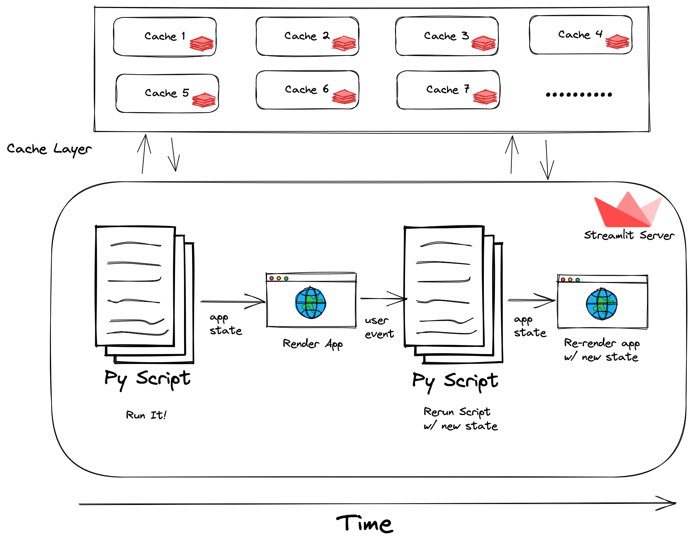

<!-- Intro -->

# Streamlit
#### Build Dashboards that are Lit 🔥

<!-- .slide: data-background="linear-gradient(rgba(0, 0, 0, 0.85), rgba(0, 0, 0, 0.65)), url('images/streamlit-bg.png')"  -->

Nick Muoh {style=color:yellow;background:#0D0D0D}

---

## What is Streamlit?

--

> **A powerful 💪🏾 python library that allows us to build interactive web apps for data 📊 dashboards or ML 🤖 models**

--

Do I need front-end web development experience?

 {.fragment .fade-in}

---

## Pros
* Streamlit is accessible for everyone who understands Python. There is no requirement for HTML and CSS.
* It has a wide range of UI components. It covers almost every common UI component such as checkbox, slider, a collapsible sidebar, radio buttons, file upload, progress bar, etc. Moreover, these components are very easy to use. {.fragment .fade-right}
* It supports multiple interactive visualization libraries such Latex, OpenCV, Vega-Lite, etc. {.fragment .fade-right}

--

## Cons
* While not difficult, Streamlit does require some time to learn its own syntax.
* Streamlit is not that flexible. It is only based on Python, offers a limited set of widgets, and doesn’t integrate with Python Notebooks. {.fragment .fade-right}
* Compared to other tools running large scripts can be inefficient. {.fragment .fade-right}
* Streamlit’s Data caching cannot keep track of changes to the data happening outside the function body. {.fragment .fade-right}

---

**Streamlit Architecture Overview**

--

In summary...

1. Streamlit apps are Python scripts that run from top to bottom 
2. Every time a user opens a browser tab pointing to your app, the script is re-executed {.fragment .fade-right}
3. As the script executes, Streamlit draws its output live in a browser {.fragment .fade-right}

--

4. Scripts use the Streamlit cache to avoid recomputing expensive functions, so updates happen very fast
5. Every time a user interacts with a widget, your script is re-executed and the output value of that widget is set to the new value during that run. {.fragment .fade-right}
6. Streamlit apps can contain multiple pages, which are defined in separate `.py` files in a `pages` folder. {.fragment .fade-right}

---

Demo Time

